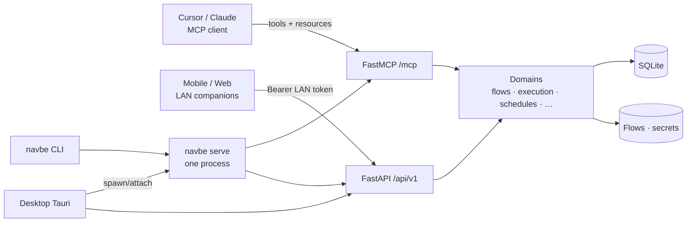

# Navbe

<p align="center">
  <strong>Local-first workflow orchestration for AI agents — MCP, schedules, and HTTP in one daemon.</strong>
</p>

<p align="center">
  <a href="https://www.python.org/"></a>
  <a href="https://docs.astral.sh/uv/"></a>
  <a href="https://fastapi.tiangolo.com/"></a>
  <a href="https://gofastmcp.com/"></a>
  <a href="https://langchain-ai.github.io/langgraph/"></a>
  <a href="LICENSE"></a>
</p>

Navbe lets Cursor, Claude Desktop, and other MCP clients **compose flows, run them, schedule them, and keep secrets local** — without a cloud control plane in the critical path.

Control-plane state lives in **SQLite**. Analytics stays out of process (an independent store later — not an embedded DuckDB sink). Agents talk to one process: `navbe serve` exposes **MCP at `/mcp`**, the schedule ticker, and the REST API.

---

## Start here — Install

> **First time?** Install the CLI, bootstrap the daemon, then restart your agent client.

| | |
| - | - |
| **[docs/install.md](docs/install.md)** | One-liner install, data home, releases |
| **[docs/connect_agents.md](docs/connect_agents.md)** | Wire Cursor / Claude Desktop to MCP |
| **[docs/agents/quickstart.md](docs/agents/quickstart.md)** | Contributor context and repo map |
| **Duration** | ~5 minutes to a connected MCP server |

### macOS / Linux / WSL

```bash
curl -fsSL https://raw.githubusercontent.com/leonardoburbanov/navbe_ai/main/scripts/install.sh | bash
```

### Windows (PowerShell)

```powershell
irm https://raw.githubusercontent.com/leonardoburbanov/navbe_ai/main/scripts/install.ps1 | iex
```

That installs `navbe`, starts `navbe serve` in the background, and writes Cursor / Claude Desktop config to:

`http://127.0.0.1:8000/mcp`

Then **restart Cursor or Claude Desktop** and confirm tools appear (`navbe_howto`, `catalog_steps`, `flow_list`, …).

```bash
navbe status
navbe secret set YOUR_KEY --app your_app   # when a connector needs it
```

Or with [uv](https://docs.astral.sh/uv/) directly:

```bash
uv tool install navbe
navbe bootstrap
```

> If the PyPI package is not published yet, the install scripts fall back to git.

---

## What Navbe includes

<table>
<tr><td><b>One local daemon</b></td><td>MCP + schedules + REST from <code>navbe serve</code> — no separate control plane.</td></tr>
<tr><td><b>Agent-first MCP</b></td><td>Catalog, flows, runs, secrets, schedules, and GitHub sync as stable tool names.</td></tr>
<tr><td><b>Desktop ops console</b></td><td>Windows Tauri app starts/attaches the daemon; full GUI + LAN “Allow mobile”.</td></tr>
<tr><td><b>Mobile + web companions</b></td><td>Pair over Wi‑Fi to run/monitor flows &amp; schedules from phone or browser.</td></tr>
<tr><td><b>LangGraph execution</b></td><td>FlowSpec → graph compile/run, checkpoints, HITL <code>approval</code>, cancel / resume.</td></tr>
<tr><td><b>Schedules that fire locally</b></td><td>Relative (<code>+30s</code> / <code>+1h</code>) or cron — ticker runs only while serve is up.</td></tr>
<tr><td><b>Secrets stay on disk</b></td><td><code>$secret</code> resolves from local credentials JSON — never echoed in tool responses.</td></tr>
<tr><td><b>GitHub workspace sync</b></td><td>Mirror flows and schedules to a repo via GitHub App device flow.</td></tr>
</table>

---

## Architecture



| Layer | Path | Role |
| ----- | ---- | ---- |
| **CLI** | [`src/navbe/cli/`](src/navbe/cli/) | Human ops: bootstrap, status, secrets, sync, browse |
| **Desktop** | [`desktop/`](desktop/) | Tauri ops console + engine lifecycle + Allow mobile |
| **Mobile** | [`mobile/`](mobile/) | Expo LAN companion |
| **Web** | [`web/`](web/) | Vite LAN companion (responsive) |
| **MCP** | [`src/navbe/mcp_app/`](src/navbe/mcp_app/) | Thin FastMCP tools / resources → domain services |
| **API** | [`src/navbe/api/`](src/navbe/api/) | Thin FastAPI routes → same services |
| **Domains** | [`src/navbe/domains/`](src/navbe/domains/) | Use-cases (`models` / `interfaces` / `service`) |
| **Core** | [`src/navbe/core/`](src/navbe/core/) | Config, async DB, exceptions |

### Project structure

```
navbe_ai/
├── README.md
├── AGENTS.md                 # Coding rules for AI agents in this repo
├── pyproject.toml
├── scripts/
│   ├── install.sh            # End-user installer (Unix)
│   └── install.ps1           # End-user installer (Windows)
├── desktop/                  # Tauri Windows ops console (EPIC 20)
├── mobile/                   # Expo LAN companion (EPIC 21)
├── web/                      # Vite LAN companion (EPIC 22)
├── claude-plugin/            # Claude Desktop plugin + skill
├── docs/
│   ├── install.md
│   ├── connect_agents.md
│   └── agents/               # Architecture, operations, EPICs
├── src/navbe/
│   ├── cli/
│   ├── api/
│   ├── mcp_app/
│   ├── core/
│   └── domains/              # steps, connectors, flows, execution, …
└── tests/
```
---

## Prerequisites

| Tool | Used for | Install |
| ---- | -------- | ------- |
| **uv** | Python deps and `navbe` tool install | [astral.sh/uv](https://docs.astral.sh/uv/getting-started/installation/) |
| **Python 3.12+** | Runtime | via uv / system |
| **Git** | Contributor checkout, GitHub sync | [git-scm.com](https://git-scm.com/) |
| **Cursor or Claude Desktop** | MCP client (optional for CLI-only use) | — |

---

## Quick start

### 1 — Install and bootstrap

```bash
# one-liner (preferred) or:
uv tool install navbe
navbe bootstrap
navbe status
curl -s http://127.0.0.1:8000/health
```

### 2 — Connect an agent

Follow **[docs/connect_agents.md](docs/connect_agents.md)**. Bootstrap usually writes MCP config; then reload the client.

Pasteable config (if you configure manually):

```json
{
  "mcpServers": {
    "navbe": {
      "url": "http://127.0.0.1:8000/mcp"
    }
  }
}
```

### 3 — Typical agent loop

1. Call `navbe_howto` if you are new to the tool surface  
2. `catalog_steps` / `catalog_connectors` — discover what you can compose  
3. `secret_set` — store API keys locally (never in flow JSON plaintext)  
4. `flow_create` / `flow_validate` — author a FlowSpec  
5. `flow_run` — execute (ask the user first; default `wait=true`)  
6. `schedule_*` — recur while `navbe serve` is up  
7. `sync_*` / `auth_github_*` — optional GitHub mirror of flows + schedules  

---

## Commands reference

### End-user CLI

| Command | Description |
| ------- | ----------- |
| `navbe bootstrap` | Data dirs + `serve --detach` + write MCP client configs |
| `navbe serve [--detach]` | Foreground or background daemon |
| `navbe status` / `navbe stop` | Health / stop |
| `navbe setup` | Interactive onboarding |
| `navbe secret …` | Local credentials store |
| `navbe mcp configure` | Merge MCP URL into Cursor / Claude configs |
| `navbe sync …` | GitHub workspace mirror |
| `navbe flows` / `navbe runs` / `navbe steps` | Browse local state |
| `navbe --help` | Full surface |

### Contributor (`uv run` from a checkout)

| Command | Description |
| ------- | ----------- |
| `uv sync` | Install deps |
| `uv run navbe bootstrap` | Same as end-user bootstrap, from the working tree |
| `uv run pytest` | Test suite |
| `uv run ruff check .` | Lint |
| `uv run ty check src/` | Typecheck |
| `uv run lint-imports` | Architecture boundaries (`.importlinter`) |

---

## Development workflow

```bash
git clone https://github.com/leonardoburbanov/navbe_ai.git
cd navbe_ai
uv sync
uv run navbe bootstrap
```

```bash
# Terminal — daemon (or rely on bootstrap --detach)
uv run navbe serve

# Another terminal — tests / lint while iterating
uv run pytest
uv run ruff check .
uv run ty check src/
uv run lint-imports
```

1. **Install** — [docs/install.md](docs/install.md)  
2. **Connect** — [docs/connect_agents.md](docs/connect_agents.md)  
3. **Build** — domain pattern in [AGENTS.md](AGENTS.md)  
4. **Test** — `uv run pytest` (mock at Protocol boundaries; no live prod APIs in unit tests)  
5. **Ship** — tag `v*` for release workflow (wheel / install scripts / PyPI)

Coding conventions and layering rules for agents working in this repo: **[AGENTS.md](AGENTS.md)**.

---

## Documentation

| Resource | What's covered |
| -------- | -------------- |
| [docs/install.md](docs/install.md) | One-liner install, Desktop, mobile/web companions |
| [docs/connect_agents.md](docs/connect_agents.md) | Cursor / Claude Desktop MCP wiring |
| [docs/agents/quickstart.md](docs/agents/quickstart.md) | Repo map for contributors |
| [docs/agents/architecture.md](docs/agents/architecture.md) | Layers, domains, sync, execution, UIs |
| [docs/agents/operations.md](docs/agents/operations.md) | Env vars, ops commands |
| [docs/agents/delivery.md](docs/agents/delivery.md) | EPIC index (incl. Desktop / mobile / web) |
| [mobile/README.md](mobile/README.md) | Expo companion runbook |
| [web/README.md](web/README.md) | Vite companion runbook |
| [desktop/BUILD.md](desktop/BUILD.md) | Windows packaging |
| [AGENTS.md](AGENTS.md) | Always-on rules for coding agents |
| [claude-plugin/](claude-plugin/) | Claude Desktop plugin + `navbe-flows` skill |

---

## Contributing

See **[CONTRIBUTING.md](CONTRIBUTING.md)** for setup, PR expectations, and checks.

- Prefer extending an existing domain under `src/navbe/domains/` over new top-level packages.
- Keep MCP tools and HTTP routes thin — business logic lives in domain `service.py`.
- Ask before changing MCP tool names or argument shapes (agents depend on stability).
- Never commit `.env`, `navbe_credentials.json`, or live secret values.
- Security reports: **[SECURITY.md](SECURITY.md)** (private advisory, not public issues).
- Community norms: **[CODE_OF_CONDUCT.md](CODE_OF_CONDUCT.md)**.

Issues and PRs welcome on [GitHub](https://github.com/leonardoburbanov/navbe_ai). `main` requires a PR and a green **CI** check.

---

## About the author

<table>
<tr>
<td width="140" valign="top">

</td>
<td valign="top">

**Leonardo Burbano** · Senior AI Engineer & Tech Lead · @Mercately [Techstars]

<a href="https://github.com/leonardoburbanov"></a>
<a href="https://www.linkedin.com/in/leoburbano/"></a>
<a href="https://www.instagram.com/leo.burbano.ai/"></a>

I lead the AI team at Mercately, designing and shipping conversational agents, RAG pipelines, and multi-agent workflows on Google Cloud and Gemini.

</td>
</tr>
</table>

---

## License

Copyright 2026 Leonardo Burbano

Licensed under the [Apache License, Version 2.0](LICENSE).

```text
Licensed under the Apache License, Version 2.0 (the "License");
you may not use this file except in compliance with the License.
You may obtain a copy of the License at

    http://www.apache.org/licenses/LICENSE-2.0

Unless required by applicable law or agreed to in writing, software
distributed under the License is distributed on an "AS IS" BASIS,
WITHOUT WARRANTIES OR CONDITIONS OF ANY KIND, either express or implied.
See the License for the specific language governing permissions and
limitations under the License.
```

Built as a **local-first MCP orchestration engine** for AI agents.
